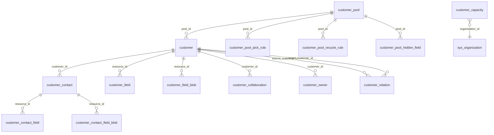
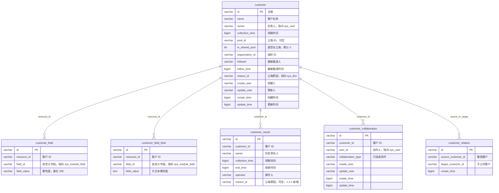
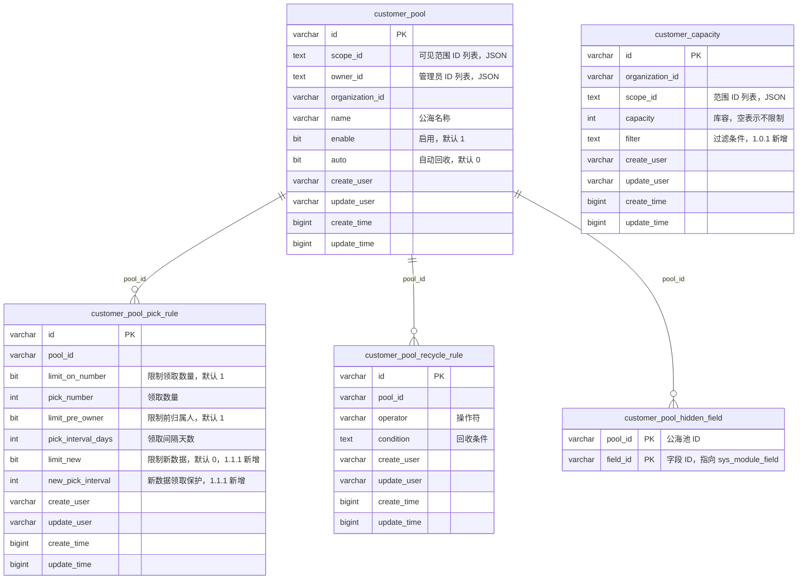
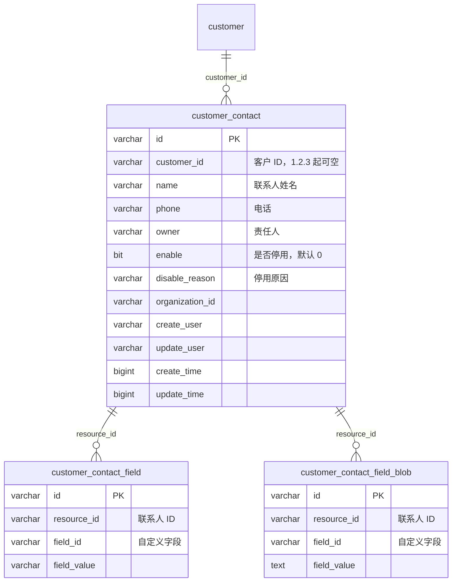
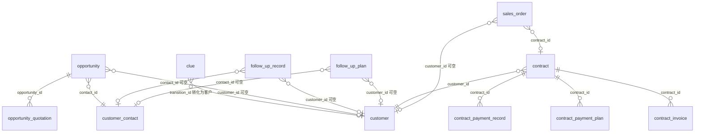

# 客户数据表结构与外在引用

依据 `backend/crm/src/main/resources/migration` 中的建表与变更脚本，以及 `cn.cordys.crm.customer.domain` 实体整理。当前脚本**没有声明数据库外键**，下文连线都是按字段注释、索引和业务用法得到的逻辑引用。

时间字段均为毫秒时间戳（`BIGINT`）。`create_user` / `update_user` / `owner` / `follower` / `operator` / `user_id` 逻辑指向 `sys_user.id`。`organization_id` 逻辑指向 `sys_organization.id`。

`CustomerContactBlob`（`@Table(name = "customer_contact_blob")`）没有对应建表脚本，实际大文本表是 `customer_contact_field_blob`，因此不纳入图。

## 客户域内部关系

`customer_capacity` 按组织与范围限制负责人库容，不直接挂在单条客户上。`customer_relation` 的两端都指向 `customer`，分别表示集团客户与子公司客户。

## 客户主数据

`customer.reason_id` 于 1.1.1 增加。索引：`organization_id`、`pool_id`、`follower`、`follow_time`、`reason_id`。`customer_field` 复合索引为 `(resource_id, field_id, field_value)`。

## 公海与库容

`scope_id`、`owner_id` 存的是 JSON 数组，分别对应部门/人员范围和用户，不是单列外键。`customer_pool_hidden_field` 主键为 `(pool_id, field_id)`。

## 联系人

建表注释把 `customer_contact_field.resource_id` 写成了「客户 id」，查询与实体实际按联系人记录关联。索引：`customer_contact(customer_id, organization_id, phone)`。

## 外在引用

其他业务表通过 `customer_id`、`contact_id` 或线索转化字段指向客户域。发票、回款计划、回款记录、报价单不直接存客户 ID，而是经合同或商机间接到达客户。

| 外部表 | 引用列 | 指向 | 约束与索引 |
| --- | --- | --- | --- |
| `clue` | `transition_id` | `customer.id`（`transition_type` 表示转为客户时） | 可空，注释为客户或商机 ID |
| `opportunity` | `customer_id` | `customer.id` | 1.1.9 起可空；`idx_customer_id` |
| `opportunity` | `contact_id` | `customer_contact.id` | 建表为非空 |
| `follow_up_record` | `customer_id` / `contact_id` | 客户 / 联系人 | 均可空，各有索引；也可指向线索或商机 |
| `follow_up_plan` | `customer_id` / `contact_id` | 客户 / 联系人 | 均可空，各有索引 |
| `contract` | `customer_id` | `customer.id` | 非空；`idx_customer_id` |
| `sales_order` | `customer_id` | `customer.id` | 可空；`idx_customer_id`；同时可指向 `contract` |

间接路径：

- `opportunity_quotation.opportunity_id` → `opportunity.customer_id`
- `contract_invoice.contract_id` → `contract.customer_id`
- `contract_payment_plan.contract_id` → `contract.customer_id`
- `contract_payment_record.contract_id` → `contract.customer_id`

## 系统表引用

```mermaid
erDiagram
    sys_organization ||--o{ customer : organization_id
    sys_organization ||--o{ customer_pool : organization_id
    sys_organization ||--o{ customer_contact : organization_id
    sys_organization ||--o{ customer_capacity : organization_id
    sys_user ||--o{ customer : "owner / follower / create_user / update_user"
    sys_user ||--o{ customer_contact : owner
    sys_user ||--o{ customer_collaboration : user_id
    sys_user ||--o{ customer_owner : "owner / operator"
    sys_dict ||--o{ customer : reason_id
    sys_dict ||--o{ customer_owner : reason_id
    sys_module_field ||--o{ customer_field : field_id
    sys_module_field ||--o{ customer_field_blob : field_id
    sys_module_field ||--o{ customer_contact_field : field_id
    sys_module_field ||--o{ customer_contact_field_blob : field_id
    sys_module_field ||--o{ customer_pool_hidden_field : field_id
    sys_department ||--o{ customer_pool : "scope_id JSON"
    sys_department ||--o{ customer_capacity : "scope_id JSON"
```

`sys_attachment.resource_id` 与 `sys_operation_log.resource_id` 是按模块区分的多态资源 ID。客户、联系人附件和操作日志会写入这两张表，但列本身不专属于客户表。

库层维护客户自定义表单字段的正确做法见 [customer-module-form-ops.md](./customer-module-form-ops.md)。
